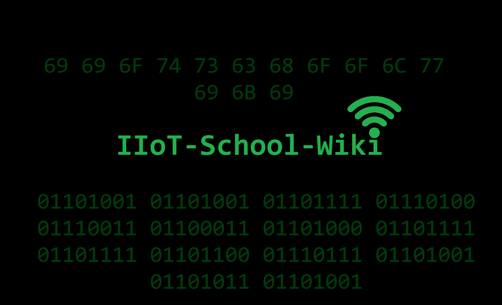

  
# IIoT-School-Wiki
Sperimentazione di apparecchiature LoRa.

## Scopo del progetto
Documentare il funzionamento del materiale fornito attraverso dei progetti legati all'IIoT (Industrial Internet of Things).

## Lista del materiale
- Arduino Student Kit x1
- Ursalink Environment Monitoring Sensor x1 (EM500-SMT)
- Milesight LoRa Portable Socket x1 (WS522)
- Milesight LoRa IoT Sensor x1 (EM300-SDL)
- Milesight LoRaWAN IoT Ultrasonic Distance Sensor x1 (EM310-UDL)
- Milesight LoRa Gateway x1 (UG65)
- Milesight Indoor Ambience Monitoring Sensor LoRaWAN x1 (AM319-HCHO)
- CompuStore kit 37 sensori per Arduino x1
- CanaKit (Raspberry + Arduino) x1

## Struttura della Wiki
La Wiki può essere consultata nei seguenti *tre* formati:
- [GitHub](https://github.com/mrnightwatch1141/IIoT-School-Wiki/wiki)
- PDF (Coming Soon...)
- Pagina Web (Coming soon...)

## Credits
_Fondatore, scrittore e programmazione_: **Angelo De Florio**
 
_Supporters_: **Arcangelo Gabriele Dispoto, Alessandro Cassone e Maurizio Mazzeo**

# Altri contenuti in arrivo!
  
Se questa wiki ti è stata utile, considera l'idea di lasciare una stella qui su GitHub! Aiuta molto a crescere e a far conoscere il progetto.

# Per contribuire...
Per qualsiasi correzione, suggerimento o cambiamento nei contenuti del progetto siete pregati di aprire una Pull Request. Grazie per la collaborazione!  

